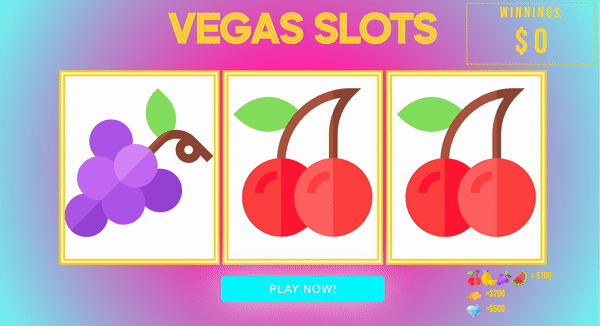

# Slot Machine
## Overview
Slot machines are one of the easiest and most classic gambling games that allows the player to earn money by the push of a button. This browser based slot machine was built using HTML, CSS, and Javascript. 

## Getting Started
  
Upon pressing the play button, game will generate random pattern of icons. If the icons match, user can win either $100, $200, or $500 depending on the icons displayed. Winnings are accumulated after each round.  
[Link to Game](https://jenniferdinh1997.github.io/Slot-Machine/)

## Next Steps
Planned future enhancements of the slot machine include more advanced animations and pop ups that allow the user to place their own bets on the game.
